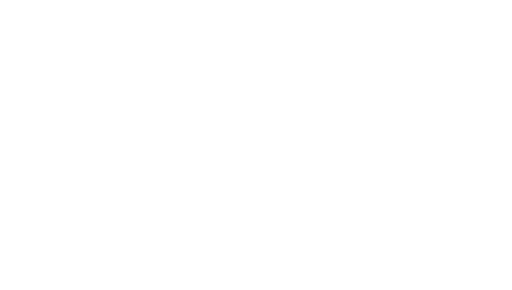
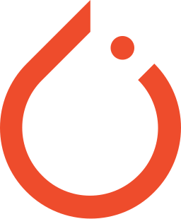



 

<h3><b style="font-size: 24px;">Ꮤ𐌄𐌋𐌂Ꝋ𐌌𐌄 𐌕Ꝋ 𐌌𐌙 𐌂Ꝋ𐌃𐌄 𐌀𐌓𐌂𐋅𐌉ᕓ𐌄 !</b></h3>
<h3>I'm a Computer Science Student and Full Stack Developer, building web apps and integrating AI to solve tech challenges.</h3>

<h2>👀 GitHub Profile View Counter:</h2>

<h2>💫 About Me:</h2>

<h3>🌱 I’m currently learning <strong>React & TypeScript</strong> </h3>

<h3>💬 Ask me about <strong>Web development & AI</strong> </h3>

<h3 style="line-height: 1.4;">💥As a<strong>  Enthusiast</strong>, I enjoy discovering <strong> AR tech and AI models</strong> and their ability to drive the future forward</h3>

<h3>📫 How to reach me: <a><strong>shakthivelmanjeedan@gmail.com</strong></a></h3>

<h2 align="center">Connect With Me 🤝:</img></h2>

    &#160;&#160;&#160;
    &#160;&#160;&#160;
    &#160;&#160;&#160;
    &#160;&#160;&#160;
    &#160;&#160;&#160;
    &#160;&#160;&#160;
  

  <h2>🛠️ Tech Stack:</h2>
  

    <h3>💻 Front End</h3>
    

      
      
       
       
       
       
       
    

     <h3>⚙️ Back End</h3>
    

      
      
       
       
       
       
    

    <h3>🤖 Machine Learning</h3>
    

       
       
       
       
       
       
    

    <h3>📱 Mobile Dev</h3>
    

      
      
  

  <h3>📚 Bundlers & Platforms</h3>
    

      
      
      
      
  

  <h3>🗄️ Database</h3>
    

      
  

  <h2>👽 My Profile Stats:</h2>

  

   

  

   

  

  <h2>🏆 GitHub Trophies:</h2>
  

    
  

